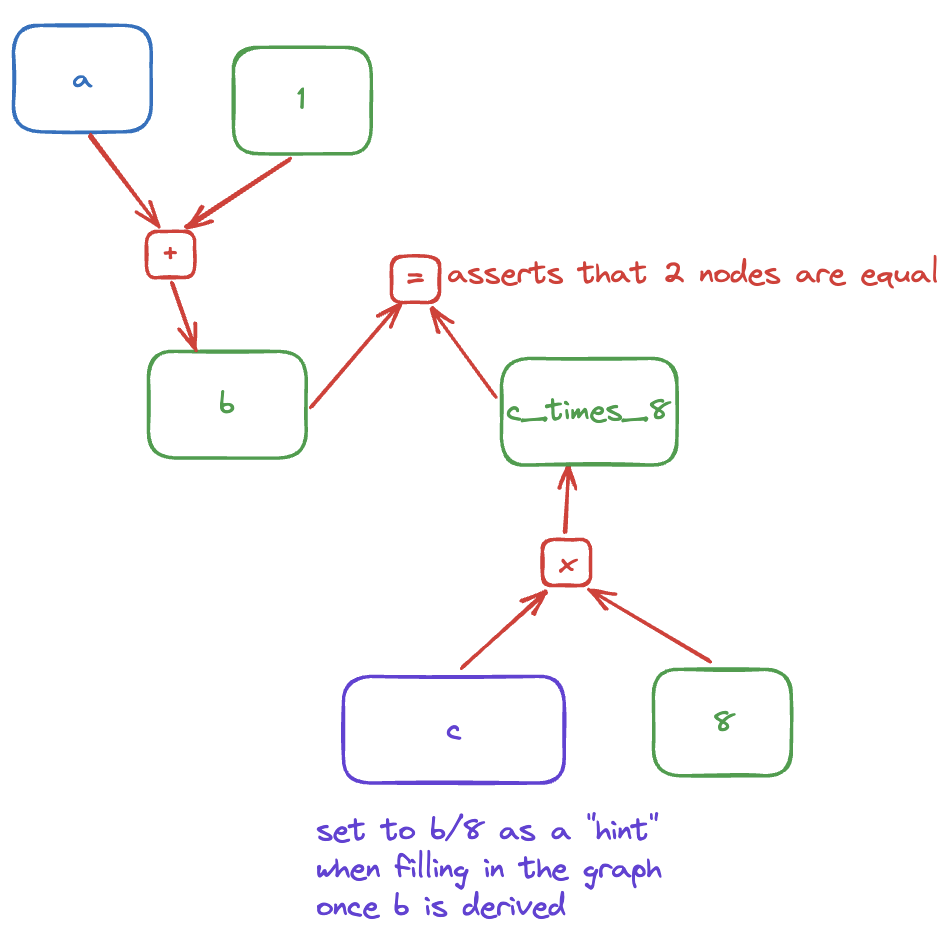

# Compgraph

## Overview
A Library to define computational graphs with nodes related by addition and multiplication

See https://hackmd.io/@succinctlabs/rJQgf5wya#Succinct-Takehome
## Features
- Multithreaded graph evaluation
- "Hint" nodes allowing arbitrary closures to be executed on other nodes' values
- Tabulation approach to graph evaluation, resulting in memory efficiency from lack of recursion, and fast execution as no node is calculated more than once
- Rustdoc documentation `cargo doc --open`
- Custom errors
- No dependencies outside std

## Usage

(a+1) / 8, represented by this computational graph, can be built, constrained, and evaluated by the following code:
```
let mut builder = Builder::new();

let a = builder.input();
let one = builder.constant(1);
let b = builder.add(a, one);
let c = builder.hint(b, |x: u64| x / 8);
let eight = builder.constant(8);
let c_times_eight = builder.mul(c, eight);

builder.assert_equal(b, c_times_eight);

builder.set_input(a, 127);

builder.evaluate();

let constraints_met = builder.check_constraints().unwrap()
```

## Potential Improvements
The current multithreading approach only parallelizes evaluation of each "layer" of nodes, defined as the set of nodes that can be evaluated with only the values from the previous layers. This is close to optimal for very dense computational graphs, but is not optimal for cases such as constraining a^100 == b^100, where the graph is "deep" but not "dense". This could in theory be improved by allowing threads to move onto future layers, skipping nodes with uncalculated parents, and then later fixing the missing values, potentially using something similar to as descibed here: https://www.microsoft.com/en-us/research/wp-content/uploads/2016/02/ppopp163-maleki.pdf